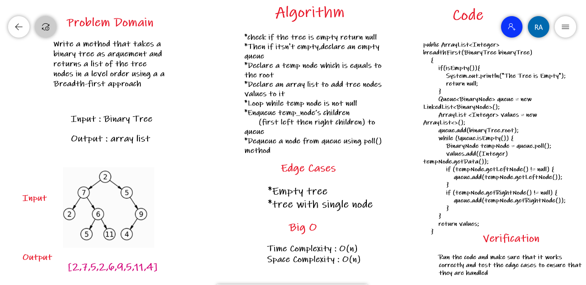

# challenge17 -Breadth-first Traversal.

## Overview

Write a method that takes a binary tree as arguement and returns a list of the tree nodes in a level order using a a Breadth-first approach

## Whiteboard Process

