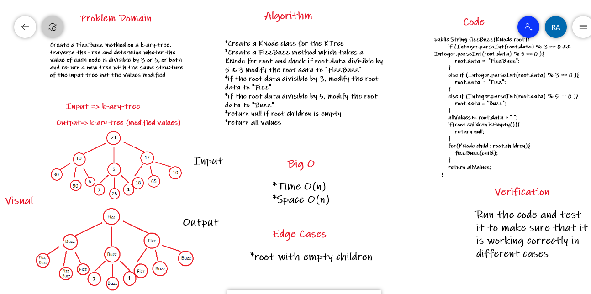

# Code Challenge - Conduct “FizzBuzz” on a k-ary tree

## Overview

Create a FizzBuzz method on a k-ary-tree, traverse the tree and determine wheter the value of each node is divisible by 3 or 5, or both and return a new tree with the same structure of the input tree but the values modified

## Whiteboard Process

