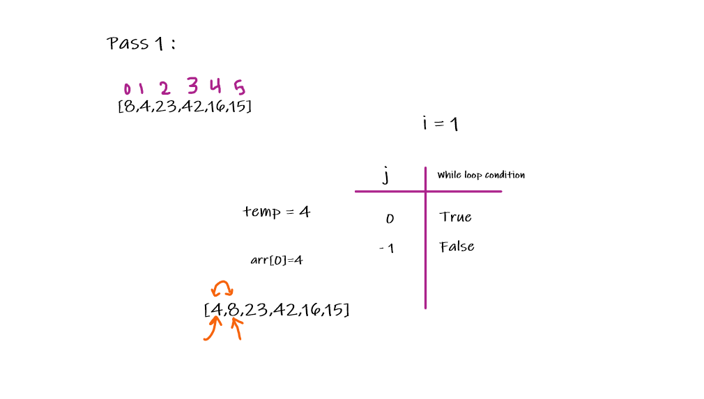
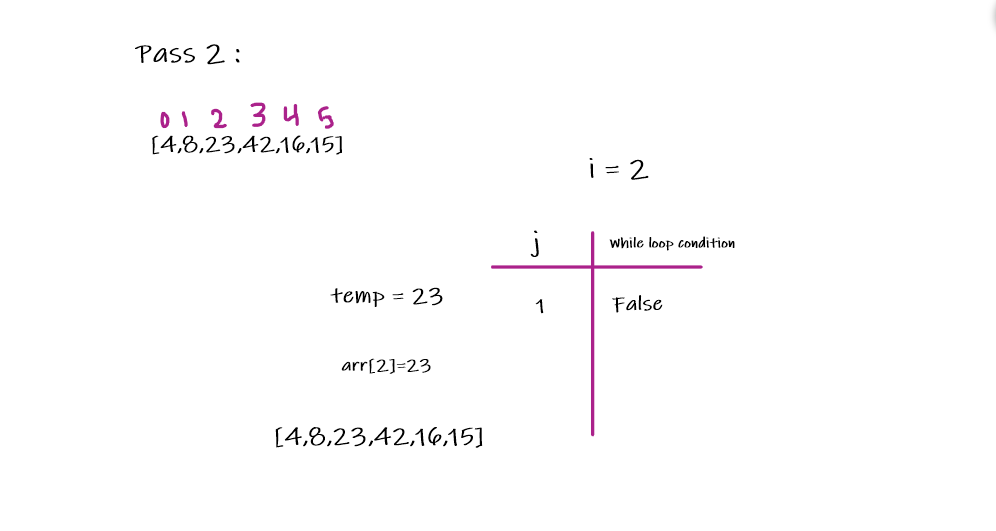
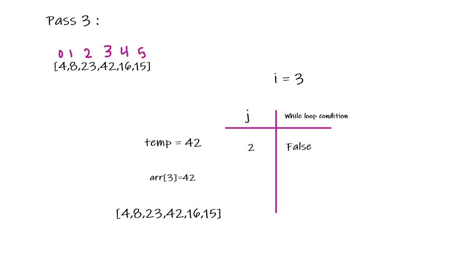
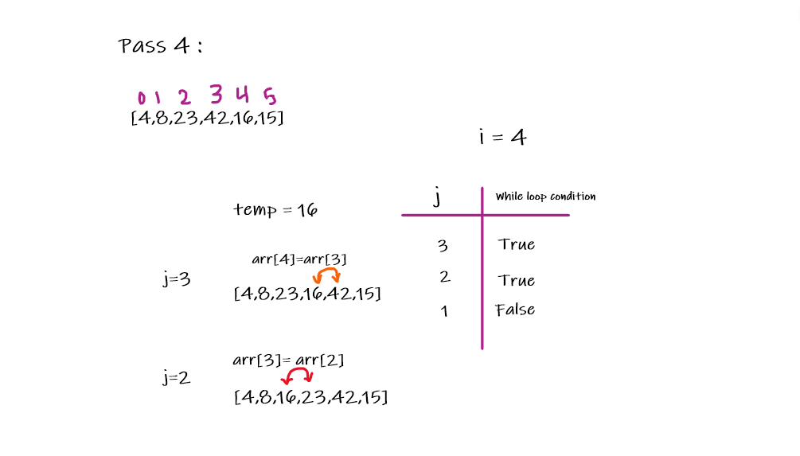
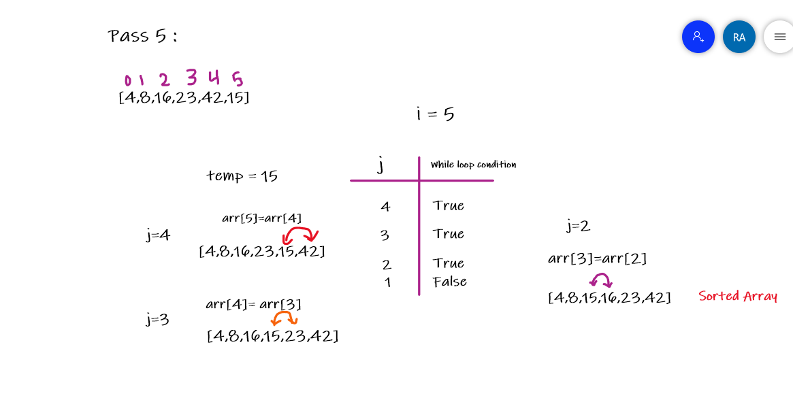

# Challenge26- Insertion Sort

## Overview
Converting the Pseudocode into code for insertionSort method that takes unsorted array of integers and sort it .

## Pseudocode

InsertionSort(int[] arr)

    FOR i = 1 to arr.length

      int j <-- i - 1
      int temp <-- arr[i]

      WHILE j >= 0 AND temp < arr[j]
        arr[j + 1] <-- arr[j]
        j <-- j - 1

      arr[j + 1] <-- temp

## Code 

    public void insertionSort(int [] arr){
    for (int i = 1 ; i<arr.length; i ++){
     int j = i-1;
     int temp = arr[i];
            while (j>=0 && temp < arr[j]){
                arr[j+1] = arr[j];
                j = j-1 ;
            }
            arr[j+1] = temp;
        }
    }

## Trace 

Sample array = [8,4,23,42,16,15]

**Pass1**

- The method will start from i = 1 until the length of the array, and inside the for loop, there is an int j and its value is i - 1 and also there is a temp and its value arr[i]. The while loop will check if the temp value is greater or smaller than the previous value. If it is smaller it will swap between the values.

- In the first Iteration the 4 value is smaller than 8 value,so it will swap between the two values.

**Pass2**

- The temp value will be 23, and it is greater than 8 so there is no change.

**Pass3**

- The temp value will be 42, which is greater than 23 so there is no change.

**Pass4**

- The temp value will be 16. This stage will be in two steps. The first step will swap between 16 and 42 and the second step will swap between 16 and 23.

**Pass5**

-  The temp value will be 15. This stage will be in three steps. The first step will swap between 15 and 42 and the second step it will swap between 15 and 23 and the last step it will swap between 15 and 16, so the array will be sorted.
