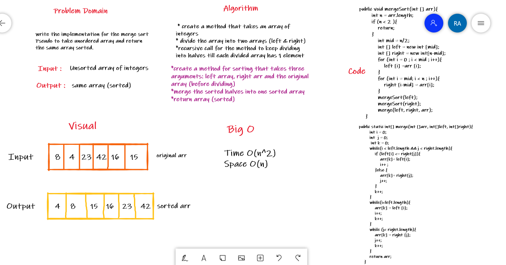
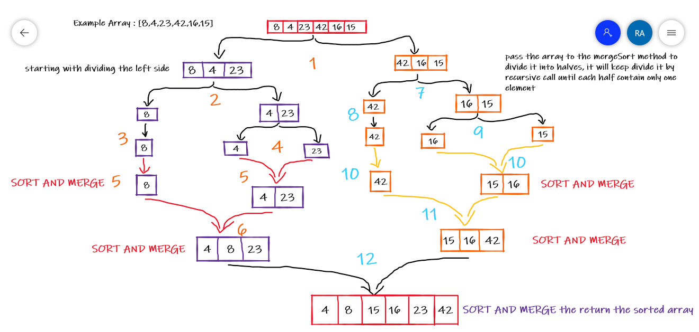

# Challenge27 - Merge Sort

## Overview
Write the Implementation for the Insertion Sort algorithm and test your implementation so you will be able to give your method an unordered array and return an ordered array.

## Pseudo Code

    ALGORITHM Mergesort(arr)
    DECLARE n <-- arr.length

    if n > 1
      DECLARE mid <-- n/2
      DECLARE left <-- arr[0...mid]
      DECLARE right <-- arr[mid...n]
      // sort the left side
      Mergesort(left)
      // sort the right side
      Mergesort(right)
      // merge the sorted left and right sides together
      Merge(left, right, arr)

      ALGORITHM Merge(left, right, arr)
      DECLARE i <-- 0
      DECLARE j <-- 0
      DECLARE k <-- 0

    while i < left.length && j < right.length
        if left[i] <= right[j]
            arr[k] <-- left[i]
            i <-- i + 1
        else
            arr[k] <-- right[j]
            j <-- j + 1

        k <-- k + 1

    if i = left.length
       set remaining entries in arr to remaining values in right
    else
       set remaining entries in arr to remaining values in left

## Code

    public void mergeSort(int [] arr){
        int n = arr.length;
        if (n < 2 ){
       return;
       }
       int mid = n/2;
       int [] left = new int [mid];
       int [] right = new int[n-mid];

            for (int i = 0 ; i < mid ; i++){
                left [i] = arr [i];
            }

            for (int i = mid; i < n ; i++){
                right [i-mid] = arr[i];
            }
            mergeSort(left);
            mergeSort(right);
            merge(left, right, arr);

    }

    public static int[] merge(int []arr, int[]left, int[]right){
        int i = 0;
        int j = 0;
        int k = 0;
        while(i < left.length && j < right.length){
            if (left[i] <= right[j]){
                arr[k]= left[i];
                i++ ;
            }else {
                arr[k]= right[j];
                j++;
            }
            k++;
        }
        while(i<left.length){
            arr[k] = left [i];
            i++;
            k++;
        }
        while (j< right.length){
            arr[k] = right [j];
            j++;
            k++;
        }

        return arr;
    }
## Whiteboard 

## Trace 

Example array = [8, 4, 23, 42, 16, 15]

