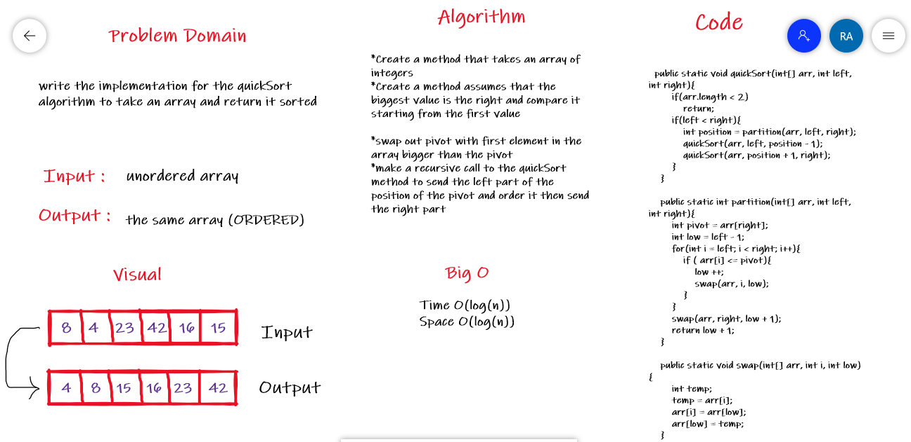
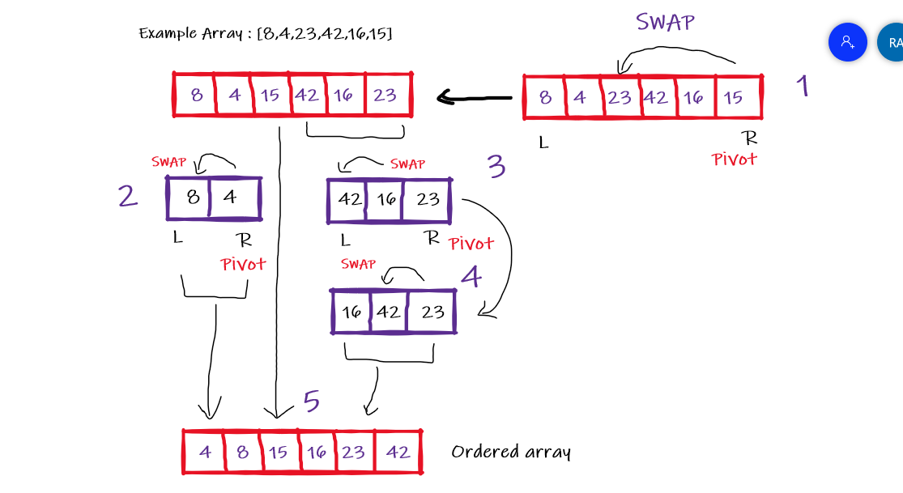

# Challenge28 - Quick Sort

## Summary

Write the Implementation for the quick Sort algorithm and test your implementation so you will be able to give your method an unordered array and return an ordered array

## Whiteboard 

## Pseudo Code
    ALGORITHM QuickSort(arr, left, right)
    if left < right
    // Partition the array by setting the position of the pivot value
    DEFINE position <-- Partition(arr, left, right)
    // Sort the left
    QuickSort(arr, left, position - 1)
    // Sort the right
    QuickSort(arr, position + 1, right)

    ALGORITHM Partition(arr, left, right)
    // set a pivot value as a point of reference
    DEFINE pivot <-- arr[right]
    // create a variable to track the largest index of numbers lower than the defined pivot
    DEFINE low <-- left - 1
    for i <- left to right do
    if arr[i] <= pivot
    low++
    Swap(arr, i, low)

     // place the value of the pivot location in the middle.
     // all numbers smaller than the pivot are on the left, larger on the right.
     Swap(arr, right, low + 1)
    // return the pivot index point
     return low + 1

    ALGORITHM Swap(arr, i, low)
    DEFINE temp;
    temp <-- arr[i]
    arr[i] <-- arr[low]
    arr[low] <-- temp

## Code 
    public static void quickSort(int[] arr, int left, int right){
      if(arr.length < 2)
      return;
      if(left < right){
        int position = partition(arr, left, right);
        quickSort(arr, left, position - 1);
        quickSort(arr, position + 1, right);
         }
       }

    public static int partition(int[] arr, int left, int right){
        int pivot = arr[right];
        int low = left - 1;
        for(int i = left; i < right; i++){
            if ( arr[i] <= pivot){
                low ++;
                swap(arr, i, low);
            }
        }
        swap(arr, right, low + 1);
        return low + 1;
    }

    public static void swap(int[] arr, int i, int low){
        int temp;
        temp = arr[i];
        arr[i] = arr[low];
        arr[low] = temp;
    }

## Trace
- pass the array to the quickSort function with the left and right (the idx of the first and the last elements)
- call the partition method so it will assume the pivot= 15 is the largest number
- compare the pivot with the elements of the array starting from left
- when we find element larger than 15 we will save it's idx (low)
- swap the pivot with the larger value and return the new position of the pivot
- recursive call for the quickSort and pass to it the segment before the new position
- recursive call for the quickSort and pass to it the segment after the new position
- after we finish the sort for the both segments we will get the ordered array

