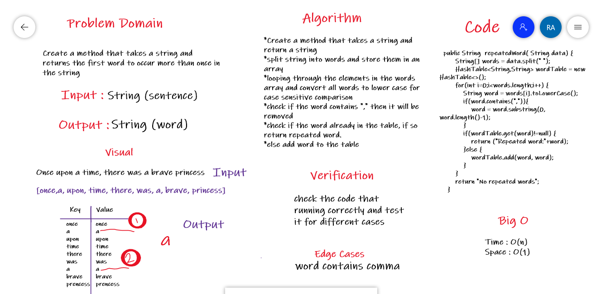
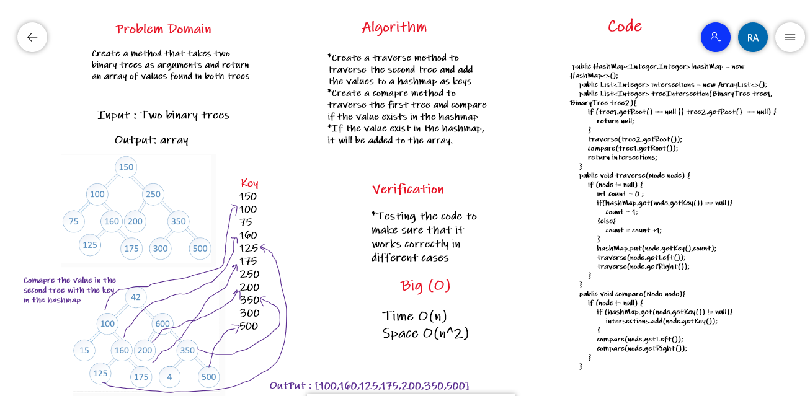

# Code Challenge: Class 30: Hash Table Implementation

## Overview 

A hash table is a data structure which is an arrayList. Each list is known as a bucket. The position of the bucket is identified by calling the hashcode() method.

## Challenge 

Implement a Hashtable Class with the following methods:

- add(K key, V value): add the key and value pair to the table.

- get(K key): Returns value associated with that key in the table

- contains: Returns boolean, indicating if the key exists in the table already.

- remove(K key): remove the value from the table based on the key.

- isEmpty(): check the hash table is empty or not.

# Code Challenge: Class 31: Find the first repeated word in a book

## Overview              

Write a method that takes a String (have sentence) then finds the first word to occur more than once in a that sentence and return the word.

## Whiteboard Process

# Code Challenge:Class 32: Find common values in 2 binary trees.

## Overview 

Create a method that takes two binary trees as arguments and return an array of values found in both trees

## Whiteboard Process

