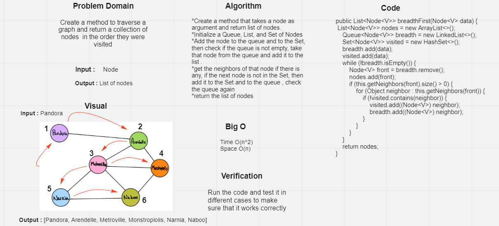
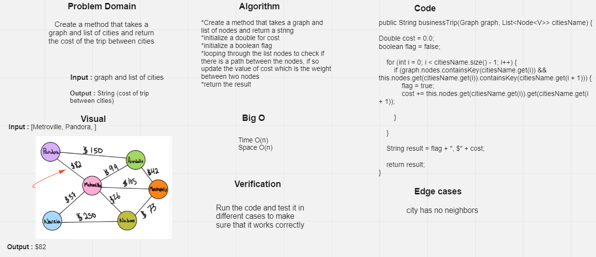

# Code Challenge: Class 35: Graph Implementation

## Challenge :

Implement your own Graph. The graph should be represented as an adjacency list, and should include the following methods:

- add node
  Arguments: value
  Returns: The added node
  Add a node to the graph 

- add edge
    - Arguments: 2 nodes to be connected by the edge, weight (optional)
    - Returns: nothing
    - Adds a new edge between two nodes in the graph
    - If specified, assign a weight to the edge
    - Both nodes should already be in the Graph
  
- get nodes
    - Arguments: none
    - Returns all of the nodes in the graph as a collection (set, list, or similar)
  
- get neighbors
    - Arguments: node
    -  Returns a collection of edges connected to the given node
       -  Include the weight of the connection in the returned collection
  
- get size
    - Arguments: none
    - Returns the total number of nodes in the graph

## Approach and Efficiency

- add Node
  - Space O(n)
  - Time O(1)
- add Edge
  - Space O(1)
  - Time O(1)
- get nodes
  - Space O(n)
  - Time O(1)
- get neighbors
  - Space O(1)
  - Time O(1)
- get size
  - Space O(1)
  - Time O(1)

# Code Challenge: Class 36 - Implement a breadth-first traversal on a graph.

## Challenge 

Create a method to traverse a graph and return a collection of nodes  in the order they were visited

## Whiteboard Process

# Code Challenge: Class 37 - graph-business-trip

## Challenge     

Create a method that takes a graph and list of cities and return the cost of the trip between cities

## Whiteboard Process

