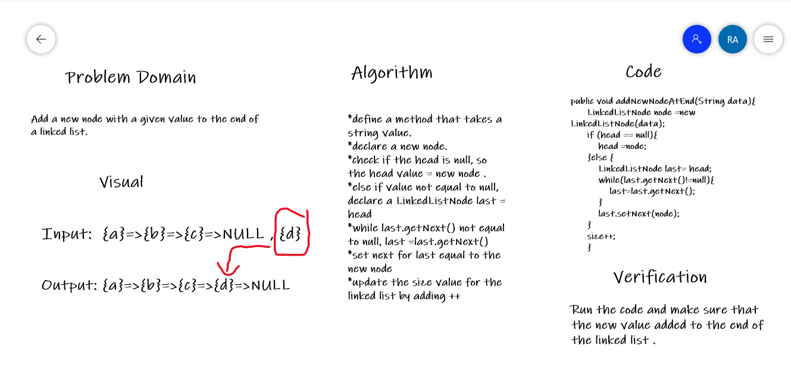
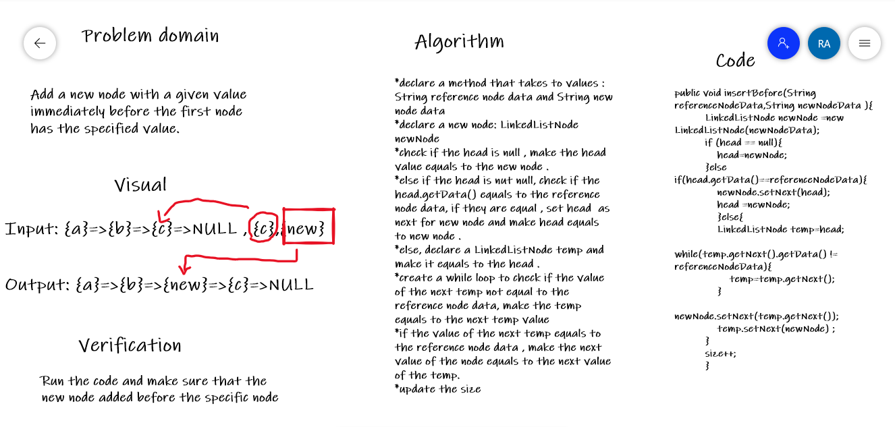
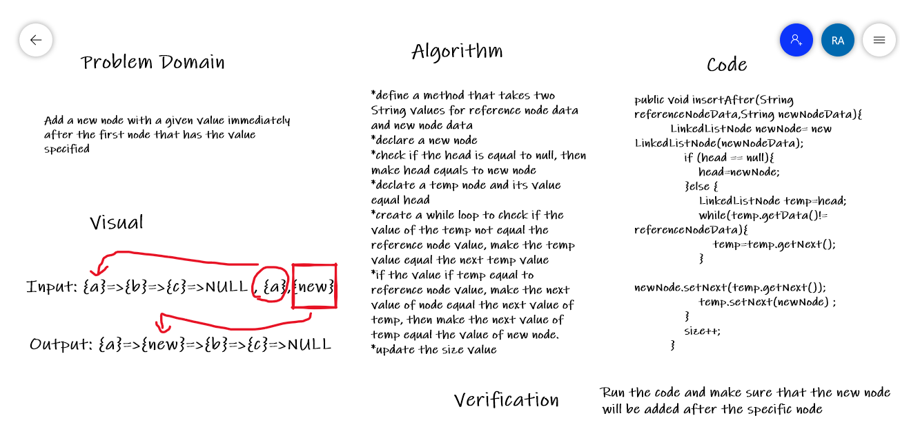

# challenge06 -linked-list-insertions

## Overview 

This challenge has three features:

1. **Append**: Add a new node with the given value to the end of the list.

2. **Insert before**: Add a new node with the given new value immediately before the first node that has the value specified.

3. **Insert after**: Add a new node with the given new value immediately after the first node that has the value specified.

## Whiteboard Process

### Append

### Insert Before 

### Insert After

