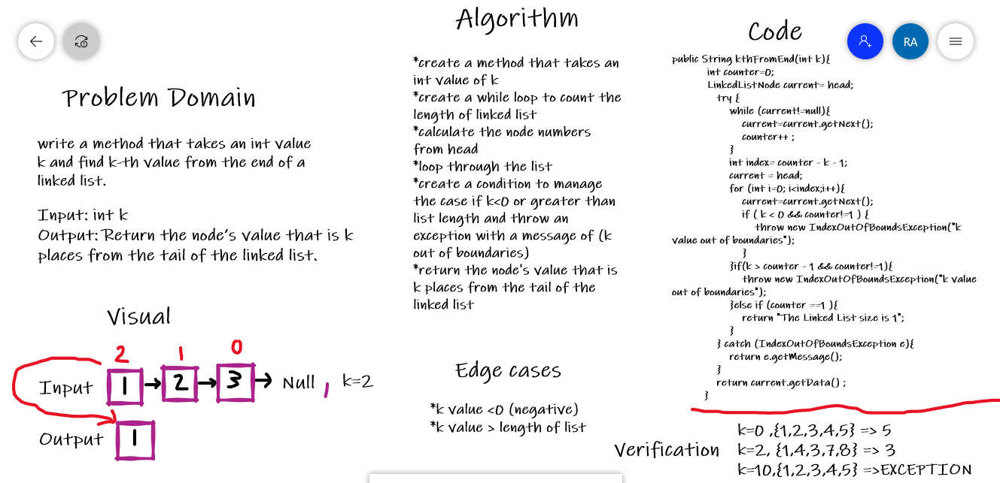

# challenge07 -Linked List kth

## Overview 

Create a method that accepts a int k as a parameter and return the node’s value that is k places from the tail of the linked list.

## Whiteboard Process

