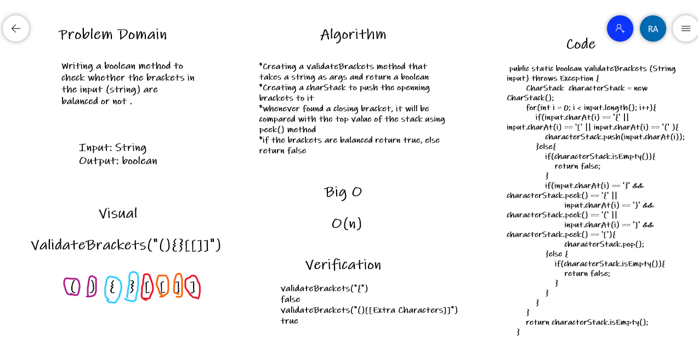

# challenge13 -Implement a Queue using two Stacks.Multi-bracket Validation.

## Overview 

Write a function called validate brackets takes string and Return boolean representing whether or not the brackets in the string are balanced

## Whiteboard Process

